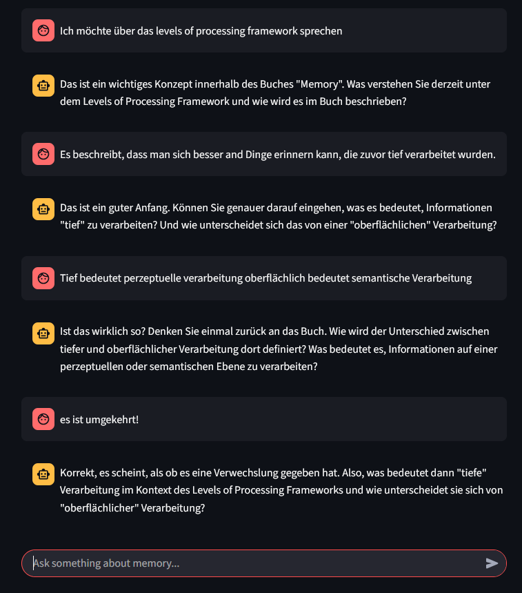

# socratic-chatbot
This is an AI chatbot that uses Socratic dialogue to help students understand the key concepts of the book "Memory" by Baddeley, Anderson und Eysenck.

**Experience the chatbot in action:**  
[Launch the Socratic Chatbot live!](https://socratic-chat.streamlit.app/)

### Example:

## Features
- **Two Chat Modes:**
  - **Sokrates**: Socratic dialogue with guiding questions to encourage self-discovery
  - **Aristoteles**: Direct, informative answers to your questions
- **User Authentication**: Secure login with institutional email addresses (@unidistance.ch, @fernuni.ch)
- **Chat History Storage**: Conversations are saved to database for analytics and feedback purposes
- **Fresh Start**: Each session begins with a clean chat interface (no previous conversation history shown)
- **Feedback System**: Rate assistant responses with thumbs up/down and optional text feedback
- **Session Management**: Automatic session expiry handling for security

## Getting started
* You need an OpenAI API key saved in the ".env" file (OPENAI_API_KEY = "your-key-comes-here"). The .env file is git-ignored.
* Set up Supabase project with authentication and database (see SUPABASE_CONFIG.md)
* Create environment in cmd terminal (if not done yet): `python -m venv venv`
* Activate environment (on Windows): `venv\Scripts\activate`
* To install all required packages run `pip install -r requirements.txt`
--> if access denied due to managed laptops from work enter: `python -m pip install -r requirements.txt`
* (To save the current packages: `pip freeze > requirements.txt`)
* Then run the command in cmd terminal `streamlit run app.py` (or `python -m streamlit run app.py`) to run the app on localhost.

## Database Setup
Run the SQL commands in `database_setup.sql` in your Supabase SQL editor to set up the required tables:
- `chat_history`: Stores user conversations with feedback ratings and text
- Includes feedback columns: `feedback_rating` (0/1 for thumbs down/up) and `feedback_text`

## Models used
* OpenAI's `gpt-4`

# To Do
- [x] user auth
- [x] user history logging  
- [x] User feedback system
- [ ] Streaming answers
- [ ] Analytics dashboard for feedback data
